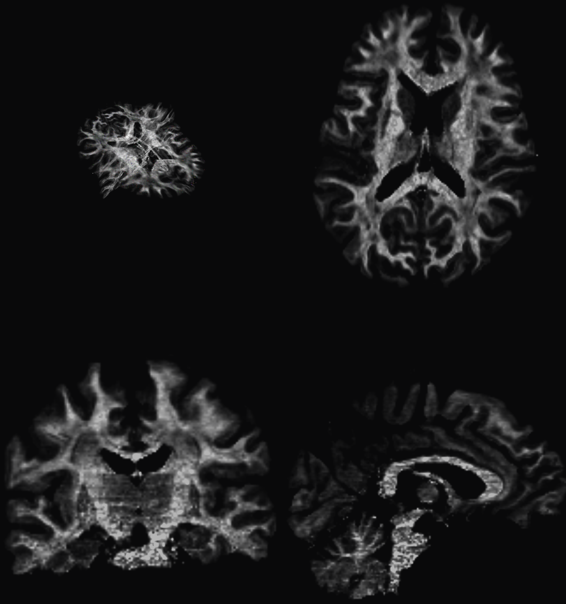
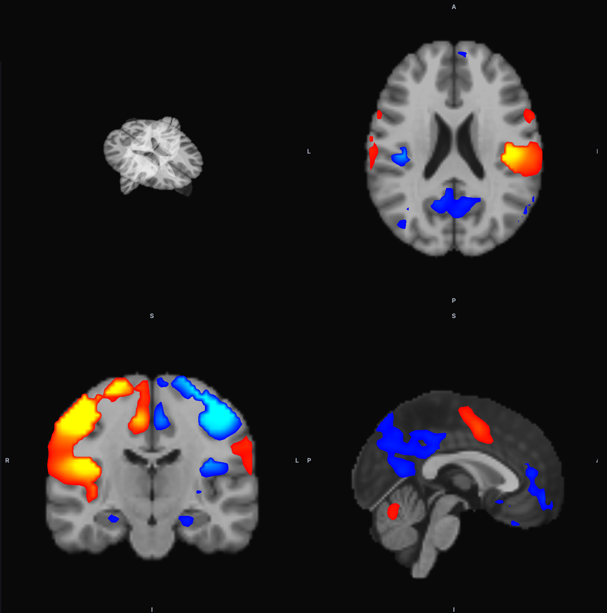
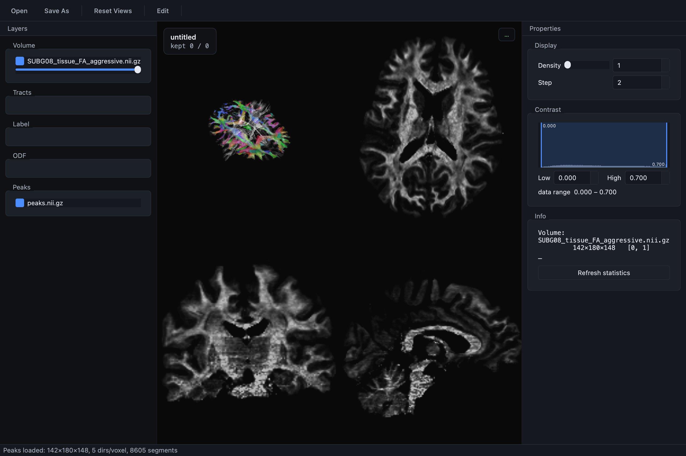
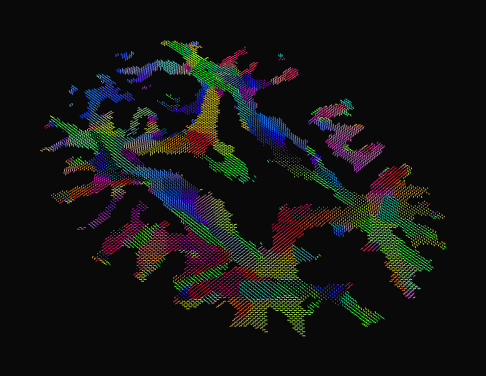

# Finch-Viewer

**A laptop-native, GPU-accelerated viewer + curation editor for diffusion & functional MRI.**

For neuroimaging researchers who inspect and **curate tractography** — and want anatomy, several whole-brain
tractograms, ODFs, peaks, and activation maps in one interactive scene, on a laptop, without a workstation.

<p align="center">
  <a href="docs/images/multimodal.png"></a>
</p>
<p align="center"><sub>Anatomy + tractography + ODF glyphs + peaks in one scene (3-D + tri-planar).</sub></p>

<p align="center">
  <a href="docs/images/fmri.png"></a>
  &emsp;
  <a href="docs/images/ui.png"></a>
  &emsp;
  <a href="docs/images/peaks.png"></a>
</p>
<p align="center"><sub>
  <b>fMRI</b>: a real motor-task t-map (nilearn sample) on the MNI152 template — diverging overlay, colorbar, orientation labels &nbsp;·&nbsp;
  <b>The app</b> &nbsp;·&nbsp; <b>Peaks</b> (DEC) &nbsp;— click to enlarge
</sub></p>

> **Status — read this first.** macOS / Metal is the **built-and-tested** path. The Windows (Direct3D 11) and
> Linux (OpenGL) backends are wired in code but **unverified — no CI, no binaries yet**. See [Platform status](#platform-status).

---

## Why a new tool?

- **macOS froze system OpenGL at 4.1** (no compute shaders), so the renderer was migrated to **Qt RHI → Metal** — the modern GPU path on Apple hardware.
- **Curating tractography means holding a lot at once.** Finch keeps several whole-brain tractograms + volumes resident and rebuilds a *sampled* view for interaction, so it stays responsive on a laptop instead of needing a workstation.

If your bottleneck is "I want to scrub, rotate, and box-edit big tractograms with a stat map on top, on my own machine," that's the gap this fills. For broad OS support or a full analysis suite *today*, the established tools (FSLeyes, MRtrix `mrview`, TrackVis, DSI Studio) are mature and cross-platform.

## What it does

- **One scene.** Anatomy + multiple tractograms + ODF glyphs + peaks + activation, in 3-D and tri-planar (2×2), with anatomical **L/R · A/P · S/I** labels on every pane.
- **Exact editing.** Draw a 3-D box to keep or delete streamlines. The on-screen view is a fast subsample, but **edits act on the full set and the save is bit-exact** — round-trip verified by a unit test.
- **Just Open.** Drop a `.trk` or NIfTI; it discriminates scalar volume vs SH-ODF vs peaks vs a signed statistical map from the header + content. No loaders, no modes.
- **fMRI activation.** Signed z/t/r maps as a **diverging, hard-thresholded overlay** over anatomy (positive red→yellow, negative blue→cyan), a data-aware threshold, and a colorbar whose **units come from the NIfTI `intent_code`** (z/t/r/F/β/p).
- **ODFs & peaks.** Spherical-harmonic ODF glyphs (GPU-built, lit, slice-following); peak fields as **DEC** line segments.

## Platform status

| Platform | Backend | State |
|---|---|---|
| **macOS (Apple Silicon)** | Metal | **Built + tested** |
| Windows | Direct3D 11 | code wired · **unverified** |
| Linux | OpenGL | code wired · **unverified** |
| CI | — | none yet |
| Self-tests | `core_selftest`, `odf_selftest` | passing (count-equivalence + bit-exact round-trip) |

`CMakePresets.json` ships Windows/Linux/vcpkg presets — treat those as **future work** until CI verifies them.

## Build & run (macOS, Homebrew Qt)

```sh
tools/build_mac.sh                                       # configure + build -> build/Finch-Viewer.app
tools/run_qt_editor.sh --open anat.nii.gz zmap.nii.gz    # launch; Open auto-detects each file
```

More in [DEV_WORKFLOW.md](DEV_WORKFLOW.md); the Python/VTK reference (the behavior source of truth) lives in [python/](python/).

## Performance & engineering

- **GPU-bound rendering.** Streamlines, tri-planar slices, lit ODF glyphs, peaks, and every colormap run on the GPU. On an **Apple M4 Pro**, camera rotation of a whole-brain tractogram (decimated display sample) is ~**8 ms/frame (~125 fps)** with no per-frame CPU geometry work. *(Observed on one machine; not yet a formal cross-hardware benchmark.)*
- **The RHI → Metal migration** is the headline engineering move (see *Why a new tool?*); the backend is selected per platform.
- **Fast where it counts.** SoA point storage with lazy FA sampling; the whole-brain SH glyph scene builds in ~15 ms (observed via the build timer); cache-friendly per-slice masking; a bounded on-screen sample with exact full-set editing.
- **Clean boundaries.** A UI-free core library (`tracto_core`: io / data / compute, no Qt/VTK), a standalone ODF library (`tracto_odf`), and the Qt app on top — with two self-tests that check count-equivalence and bit-identical round-trips. Optimizations land only with a number behind them.

## Formats, colormaps & conventions

- **Formats:** `.trk` tractograms and NIfTI (`.nii` / `.nii.gz`); affine resolved sform → qform → pixdim.
- **Colormaps:** grayscale · perceptually-uniform **viridis** (continuous metrics) · **diverging** for signed stats (positive red→yellow, negative blue→cyan) · **DEC** for orientation · categorical for labels.
- **DEC:** R = L–R, G = A–P, B = S–I.
- **Orientation labels** follow **RAS**; your data's affine determines radiological vs neurological anatomy.
- **Stat detection:** a signed map (or a recognized statistic `intent_code`) is treated as an overlay; a map with `intent_code = 0` is classified by its signed values, so a deliberately-signed scalar may be shown as a stat overlay.
- **Discrete-sphere ODFs:** only dipy's `symmetric362` sphere is embedded; a non-matching discrete-sphere ODF (e.g. 362-dir RUMBA) is **intentionally refused rather than silently mis-oriented** — opt in with `--discrete-odf` once you've verified the sphere.

## License & citation

- **License: not yet chosen.** Until a root `LICENSE` is added, default copyright applies (all rights reserved). *Pick one (MIT / BSD-3 / Apache-2 / GPL) before sharing.*
- **Citation:** a `CITATION.cff` will be added once the manuscript/preprint is finalized.
