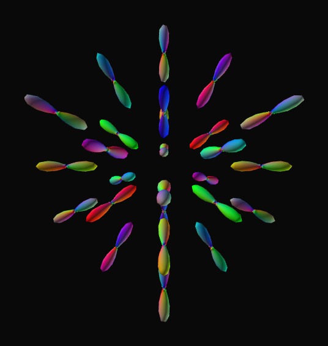

# Finch-Viewer

**Diffusion-MRI tractography & fiber orientation, in one GPU scene — just Open the file.**

<p align="center">
  
</p>

---

## Highlights

| | |
|---|---|
| **GPU fODF glyphs** | Spherical-harmonic ODFs — direction-colored, lit, GPU-rendered. |
| **Just Open** | Drop in any `.trk` or NIfTI; it reads the header and figures out the rest. |
| **One scene** | Streamlines + scalar volumes + ODFs + peaks, in 3-D and tri-planar. |
| **Exact editing** | Box-select to keep or delete streamlines on large tractograms — saves are exact. |

## Just Open

One unified **Open** auto-detects the file from its header: `.trk` vs NIfTI, and for 4-D NIfTI it tells a scalar volume from an SH-ODF from a peaks field *by content*. No loaders, no modes — just open the file.

## Everything in one scene

3-D plus tri-planar (axial / coronal / sagittal): anatomy, streamlines, glyphs, and peaks rendered together. Glyphs follow the slice you scrub.

<p align="center">
  
</p>

## Peaks

Per-voxel fiber directions as DEC line segments — red = L-R, green = A-P, blue = S-I.

<p align="center">
  
</p>

## Edit, exactly

Orbit the camera, scrub slices, and draw a 3-D selection box to keep or delete streamlines. The on-screen view is a fast subsample; edits act on the full set — so **saving is exact**.

## The app

Dense-dark UI: a Layers panel (Volume / Tracts / Label / ODF / Peaks), live contrast (intensity histogram + numeric window), per-pane reset view, and an optional FPS/GPU overlay.

<p align="center">
  
</p>

---

## Built on

- **C++ with Qt and the Qt RHI renderer**, running on **Metal** on macOS. The active editor uses **no VTK**.
- **Why RHI/Metal:** Apple froze system OpenGL at 4.1 — no compute shaders — so the renderer was migrated to Qt RHI → Metal, the modern GPU path. That migration is the project's headline move (portable to Vulkan / D3D12; macOS/Metal is what's built and tested).
- **Clean boundaries:** a UI-free core library (io / data / compute), a standalone ODF library, and the Qt app on top.
- A **Python reference** implementation (VTK) is the behavior source of truth; the C++ app is the GPU-accelerated primary editor.

**Formats:** `.trk` tractograms and NIfTI (`.nii` / `.nii.gz`).

## Build & run

On macOS (Homebrew Qt):

```sh
tools/build_mac.sh                                             # configure + build
tools/run_qt_editor.sh --open dmri-explorer/data/odf.nii.gz    # launch (Open detects the type)
```

More detail in [DEV_WORKFLOW.md](DEV_WORKFLOW.md); the Python reference lives in [python/](python/).
